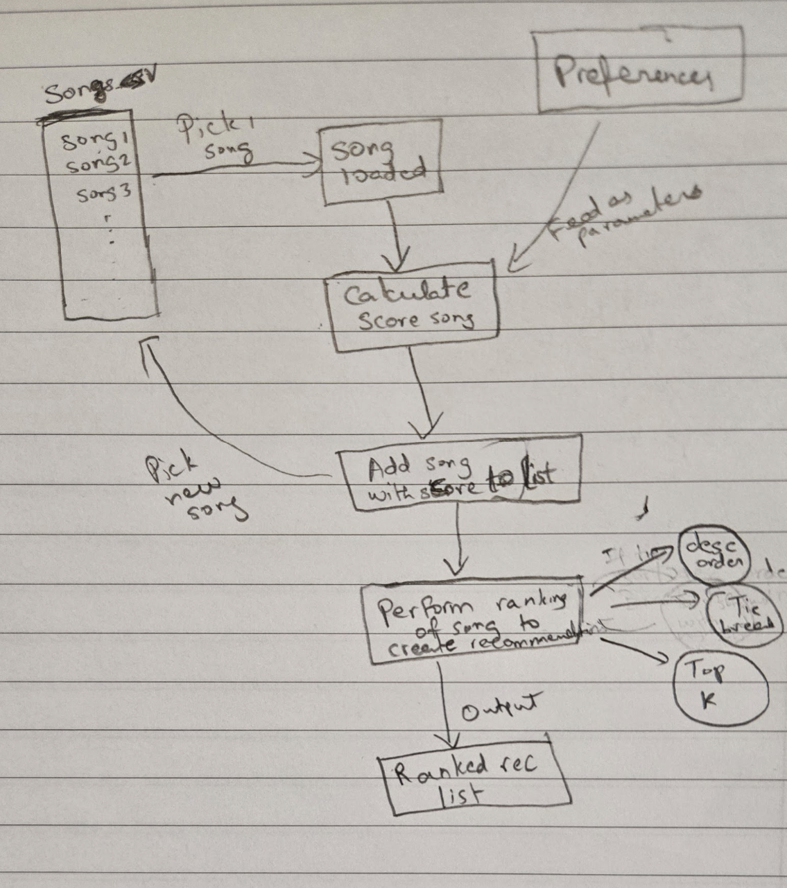

# 🎵 Music Recommender Simulation

## Project Summary

In this project you will build and explain a small music recommender system.

Your goal is to:

- Represent songs and a user "taste profile" as data
- Design a scoring rule that turns that data into recommendations
- Evaluate what your system gets right and wrong
- Reflect on how this mirrors real world AI recommenders

---

## How The System Works

Explain your design in plain language.

Some prompts to answer:

- What features does each `Song` use in your system
  - For example: genre, mood, energy, tempo
- What information does your `UserProfile` store

  Each song object in my system is decided based on four fundamental features: the target mood, target energy, genre, and acousticness. While there are other features that come into play like danceability, valence, and tempo, the four features mentioned help create the necessary information to develop the `UserProfile`, which is of key importance for the `Recommender` to help generate the ranked reccommendation list of songs.

- How does your `Recommender` compute a score for each song

  The `Recommender` chooses which songs to recommend based on a calculated weighted sum as part of the designed "Scoring Rule" for each song picked from CSV file. Due to emphasis on the person's mood rather than the genre, weights are assigned in descending order for each of the four features.

  Maximum possible score is 5.0:
  Mood = 2.0
  Energy = 1.5
  Genre = 1.0
  Acoustic = 0.5

  Score logic formula:
  score = (2.0 × mood_match) + (1.5 × energy_sim) + (1.0 × genre_match) + (0.5 × acoustic_fit)

  This score is computed for every `Song` to help accurately justify why this song fits the mood of the listener as stated in their preferenes.

- How do you choose which songs to recommend

  Based on the score assigned for each song, the scores are sorted in descending order to show the rank assigned to each song. If two songs are tied with their scores, the tie is broken by preferring the higher mood match followed by a higher energy match, and returns the top K songs.

  You can include a simple diagram or bullet list if helpful.
  

---

## Getting Started

### Setup

1. Create a virtual environment (optional but recommended):

   ```bash
   python -m venv .venv
   source .venv/bin/activate      # Mac or Linux
   .venv\Scripts\activate         # Windows

   ```

2. Install dependencies

```bash
pip install -r requirements.txt
```

3. Run the app:

```bash
python -m src.main
```

### Running Tests

Run the starter tests with:

```bash
pytest
```

You can add more tests in `tests/test_recommender.py`.

---

## Sample Recommendation Output

Paste a sample of your recommender's output here as a text block so a reader can see what it produces:

```
# e.g.:
# User profile: genre=indie, mood=chill, energy=low
# Recommendations:
#   1. ...
#   2. ...
#   3. ...
```

PS C:\Codepath class\ai110-module3show-musicrecommendersimulation-starter> python -m src.main
Loading songs from data/songs.csv...
Loaded songs: 18
Your taste profile:
mood='happy' genre='pop' energy=0.8 acoustic=0.1

Top 5 recommendations:

1. Sunrise City (pop, happy)
   Score: 4.93 / 5.00
   - matches your current mood (happy)
   - matches your favorite genre (pop)
   - energy (0.82) is close to your target (0.80)
   - acousticness (0.18) matches what you're looking for

2. Rooftop Lights (indie pop, happy)
   Score: 3.81 / 5.00
   - matches your current mood (happy)
   - energy (0.76) is close to your target (0.80)

3. Gym Hero (pop, intense)
   Score: 2.78 / 5.00
   - matches your favorite genre (pop)
   - energy (0.93) is close to your target (0.80)
   - acousticness (0.05) matches what you're looking for

4. Concrete Skyline (hip-hop, energetic)
   Score: 1.92 / 5.00
   - energy (0.85) is close to your target (0.80)
   - acousticness (0.08) matches what you're looking for

5. Night Drive Loop (synthwave, moody)
   Score: 1.86 / 5.00
   - energy (0.75) is close to your target (0.80)
   - acousticness (0.22) matches what you're looking for

**Screenshot or video** _(optional)_: <!-- Insert a screenshot or demo video link here -->

---

## Experiments You Tried

Use this section to document the experiments you ran. For example:

- What happened when you changed the weight on genre from 2.0 to 0.5?

Genre stopped being a strong enough signal to compete with energy closeness, so songs from completely unrelated genres began outranking exact genre matches whenever their energy happened to sit closer to the target. This confirmed that genre's influence on the final ranking depends entirely on its weight relative to energy, not on whether a match occurred at all.

- How did your system behave for different types of users?
  For profiles whose mood/genre combination was well represented in the catalog (like "Chill Lofi"), the top results stayed tightly matched on both genre and mood even after reweighting. For less-represented combinations (like "High-Energy Pop"), genre matches got pushed down the list more easily, showing the system is more stable for common taste profiles and more volatile for niche ones.

---

## Limitations and Risks

Summarize some limitations of your recommender.

Even though it is able properly and accurately give good forusers with many moods, it still gets confused when given user profiles with more complex favored genres, forcing the recommender to base its judgement completely on the mood. However, it does help the cause of this project becasue my recommender favors mood over genre.

Another limitation which can be a problem if this project were to be meant for real users is that the song library is really small with more pop songs compared to the rest. This can create a bias, resulting more pop songs being recommended than necessary.

You will go deeper on this in your model card.

---

## Reflection

Read and complete `model_card.md`:

[**Model Card**](model_card.md)

From this project, I was able to learn how recommender systems in popular platforms are showing users' their recommendations with the help of the mathematically constructed scoring formulas. Morever, it is also able to use content based filtering and collaborative filtering to give the best predictions.

However from evaluating my project, I was able to see certain limitations and biases that can occur in recommender systems. Due to the use of weights when implementing the scoring logic, certain attributes of a user profile may be seen as irrevlant if too much weights are assigned to other attributes. This can create a bias against certain types of songs. It is also important that the song collection is diverse with its energy level and genre to ensure any type of user will recieve recommendations accurately.
